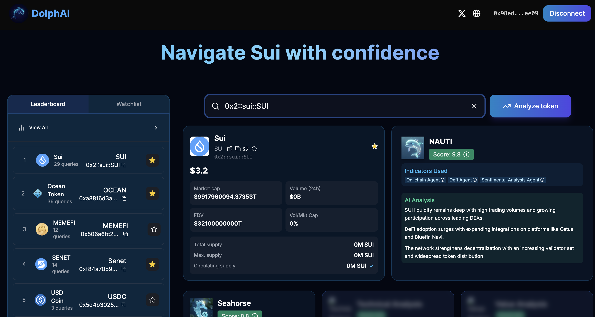

<div align="center">

# 🐬 DolphAI: Your AI-Powered Navigator for the Sui DeFi Ocean

[](https://nextjs.org/)
[](https://sui.io/)
[](https://kit.suiet.app/)
[](https://www.cetus.zone/)

> 🏆 Submission for the Sui Hackathon 2025 - Revolutionizing DeFi Navigation with AI

<p align="center">
  
</p>

</div>

## 🌟 Why DolphAI?

Navigating the DeFi ocean can be overwhelming. DolphAI is your intelligent companion that combines the power of AI with real-time DeFi data to help you make informed decisions on the Sui network.

### 🎯 Key Problems We Solve

- **Information Overload**: DeFi users struggle to process vast amounts of data across multiple platforms
- **Risk Assessment**: Difficulty in evaluating protocol safety and investment opportunities
- **Market Timing**: Challenges in identifying optimal entry and exit points
- **Protocol Integration**: Fragmented user experience across different DeFi services

## 🚀 Features

### 🧠 AI-Powered Analytics
- **NAUTI**: Our advanced AI agent that analyzes market trends and protocol health
- **Risk Scoring**: Real-time assessment of protocols and investment opportunities
- **Natural Language Insights**: Complex DeFi data translated into actionable insights

### 🔄 DeFi Integration Hub
- **Cetus Terminal Integration**: Direct access to Sui's leading DEX
- **Multi-Protocol Dashboard**: Unified view of lending, staking, and trading opportunities
- **Real-Time Data Feeds**: Live market data and protocol metrics

### 🔐 Seamless Wallet Integration
- **Suiet Wallet Kit**: One-click wallet connection and transaction signing
- **Multi-Wallet Support**: Compatible with major Sui wallets
- **Transaction Preview**: Clear visualization of transaction impact

### 📊 Advanced Market Analysis
- **Smart Money Tracking**: Follow whale movements and institutional activities
- **Correlation Analysis**: Understand relationships between different DeFi metrics

## 🛠 Technical Innovation

### Tech Stack
- **Frontend**: Next.js 14, TailwindCSS, TypeScript
- **Integration**: Cetus SDK, Suiet Wallet Kit
- **Data**: Backend integration with Blockberry 

## 🏃‍♂️ Quick Start

```bash
# Install dependencies
npm install

# Run development server
npm run dev
```

Visit `http://localhost:3000` to start exploring!


## 🚢 Deployment

```bash
# Build for production
npm run build

# Start production server
npm start
```


## 🙏 Acknowledgments

- Sui Foundation for the incredible blockchain infrastructure
- Cetus team for DEX integration support
- Suiet team for the excellent wallet kit
- Our amazing community of beta testers

---

<div align="center">

### 🐬 Built with ❤️ for the Sui Community

[Website](https://dolphai.vercel.app) · [Twitter](https://twitter.com/dolphai) · [Discord](https://discord.gg/dolphai)

</div>
